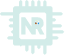

<h1 align='center'> <a href="https://buzzvel-neto-russo.vercel.app/"  target="_blank"></a> Neto Russo || Dev. Front-end || Portifólio</h1>
<p align='center'>"Desenvolvedor Front-end e Back-end com experiência em React.js, JavaScript, Java e outras tecnologias. Confira meu portfólio e entre em contato!"</p>

__________________________________________________________________________________________________________________________________________________

       

<p>Desenvolvi um portfólio personalizado para demonstrar minhas habilidades e experiência em desenvolvimento web. O projeto, construído com React.js e otimizado para SEO, apresenta um portfólio interativo com meus principais trabalhos. Através de animações e um design responsivo, o microsite oferece uma experiência imersiva e intuitiva, facilitando a navegação e o entendimento do meu perfil. Além disso, incluí um roadmap detalhado que demonstra minha trajetória profissional e meus objetivos futuros. Tenho certeza de que minha experiência e paixão pelo desenvolvimento web podem agregar grande valor a qualquer equipe</p>

__________________________________________________________________________________________________________________________________________________

Guide
=====================================
 - [Instalação e Rquerimentos](#Instalação-e-requerimentos)
 - [Resultado](#Resultado)

-----------------


<h2>Instalação e requerimentos</h2>

### Node version v18.15.0 or higher
### npm version v9.5.0 or higher

```
bash

npm install --save

```
_______________________________________________________________________________________________

<h2>Resultado</h2>

 - <h4>Menu</h4>
	
	 -  <p>Menu totalmente interativo e intuitivo com efeitos gráficos para facilitar o entendimento do usuário. Também foi implementada uma ferramenta para alterar o idioma padrão do site.</p>


 - <h4>Banner</h4>
	
	 - <p>Banner com saudação e uma breve apresentação, acompanhado de uma foto estilizada. O banner possui um vídeo de fundo e efeito parallax.</p>


 - <h4>About</h4>

	 - <p>Seção sobre mim com um texto explicando minhas buscas e uma foto profissional, abaixo de um componente de linha do tempo contando toda a minha jornada até hoje.</p>


- <h4>Projetos</h4>

	- <p>Seção de exibição dos meus principais projetos, contendo um slide com cartões mencionando as principais linguagens utilizadas e com um link para o GitHub e o site publicado.</p>


 - <h4>Contato</h4>

	 -  <p>Área de contato com um formulário funcional para até 200 mensagens por mês e alinhado com o design da página, seção com habilidades complementares e links para redes sociais e download do CV em português.</p>

  


 - <h4>Detalhes Extras</h4>

	 - <p>Todo o projeto é responsivo a todos os tipos de tela. O menu está posicionado no canto inferior esquerdo para melhorar a acessibilidade e a facilidade de uso com apenas uma mão.</p>

	 - <p>A rolagem da tela é suave e há animação para o aparecimento de entradas nos componentes, tornando todo o projeto mais harmonioso.</p>


 

	- Confira: https://netorusso.onrender.com

 #BORACODAR
